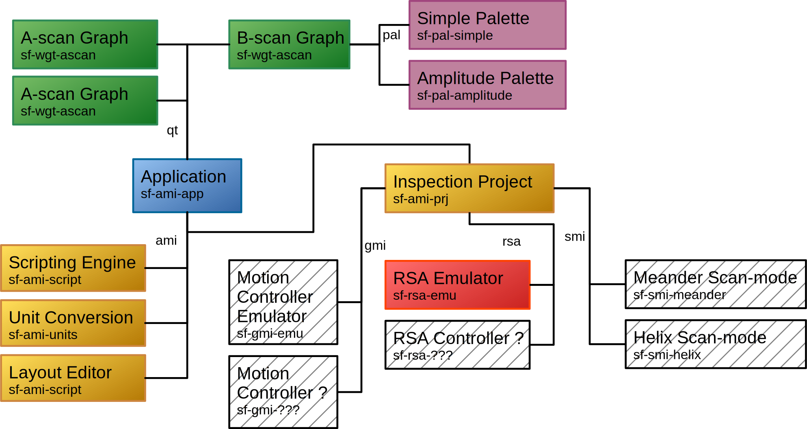

# Modular Application Reference {#mainpage}

<small>
Generated from code by [Doxygen](https://www.doxygen.nl/) (_[GitHub](https://github.com/doxygen/doxygen.git)_).
</small>

View or clone the code from [GitLab](https://git.scanframe.com/shared)
or [GitHub](https://github.com/Scanframe/sf-mod-app).

## Hierarchy

**Legend**
* **qt** : Qt Plugin Interface as used in Designer
* **ami** : Application Module Interface
* **gmi** : Generic Motion Interface
* **rsa** : Repetive Signal Acquisition Interface
* **smi** : Scan mode Interface

## Classes

### Information

Classes/Interfaces for exchanging information between application modules (dynamic libraries).

* `::sf::Variable`
* `::sf::ResultData`

### General

#### Classes  

* `::sf::Value`
* `::sf::Range`
* `::sf::RangeManager`
* `::sf::FileMappedStorage`
* `::sf::ThreadClosure`
* `::sf::Thread`
* `::sf::Mutex`
* `::sf::Sync`
* `::sf::TStaticSync`
* `::sf::Resource`

#### Template Classes

* `::sf::TVector`
* `::sf::TClosure`
* `::sf::TListener`
* `::sf::TDynamicBuffer`
* `::sf::TClassRegistration`

#### Qt Classes

* `::sf::Draw`
* `::sf::Graph`
* `::sf::GlobalShortcut` (Windows/Linux)
  
### Script / Calculator

* `::sf::ScriptEngine`
* `::sf::calculator()`

### Unit Conversion

Unit conversion related functions and classes.

* `::sf::getUnitConversion()`
* `::sf::setUnitConversionHandler()`
* `::sf::UnitConverter`
* `::sf::UnitConversionServer`

## Examples

* [Variable Handler](sf-gii-Variable.html)
* [Unit Conversion](sf-gii-UnitConversionServer.html)

